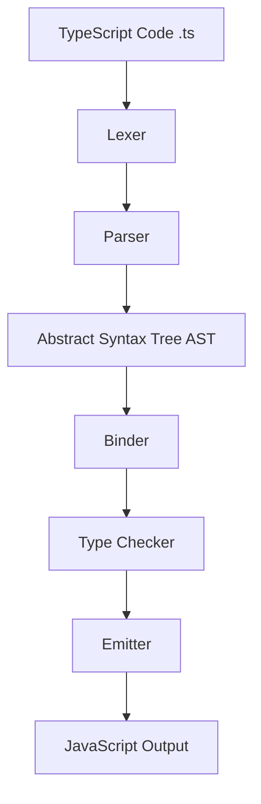

# TypeScript

## What is TypeScript?

TypeScript is a superset of JavaScript developed by Microsoft.

It adds additional features on top of JavaScript such as:

* Static typing
* Interfaces
* Enums
* Generics
* Better tooling support
* Compile-time error checking

TypeScript code eventually gets converted into plain JavaScript because browsers and Node.js only understand JavaScript.

---

# Why Do We Need TypeScript?

JavaScript is dynamically typed.

This means variables can change types anytime during runtime.

Example:

```js
let age = 20;
age = "twenty";
```

JavaScript allows this without errors.

In small projects this may look fine, but in large applications it creates:

* Runtime bugs
* Difficult debugging
* Unpredictable behavior
* Poor scalability
* Weak IDE support

TypeScript solves these problems using static type checking.

Example:

```ts
let age: number = 20;

age = "twenty"; // Error
```

Now the error is caught during development instead of production.

---

# What TypeScript Provides

## 1. Static Type Checking

```ts
const price: number = 100;
```

Prevents invalid assignments.

---

## 2. Better Auto-completion

Editors provide:

* Smart suggestions
* Function hints
* Property predictions

---

## 3. Early Error Detection

Errors are detected during compilation instead of runtime.

---

## 4. Improved Scalability

Large codebases become easier to maintain.

---

## 5. Better Refactoring

Renaming variables/functions becomes safer.

---

# Installing TypeScript

## Project-wise Installation (Recommended)

```bash
pnpm add -D typescript
```

This installs TypeScript only for the current project.

Advantages:

* Different projects can use different TS versions
* Better for teams and monorepos
* Prevents version conflicts

---

## Global Installation

```bash
pnpm add -g typescript
```

Now you can run:

```bash
tsc
```

from anywhere in the terminal.

---

# Purpose of `tsc`

`tsc` stands for:

## TypeScript Compiler

Its job is to:

* Read `.ts` files
* Type-check code
* Convert TypeScript → JavaScript

---

# Example

## TypeScript Input

```ts
const age: number = 20;
```

## JavaScript Output

```js
const age = 20;
```

---

# Running TypeScript with PNPM

## Initialize TypeScript

```bash
pnpm tsc --init
```

Creates:

```txt
tsconfig.json
```

---

## Compile Project

```bash
pnpm tsc
```

Reads `tsconfig.json` and compiles the project.

---

## Watch Mode

```bash
pnpm tsc --watch
```

Automatically recompiles when files change.

---

## Type Check Only

```bash
pnpm tsc --noEmit
```

Checks errors without generating JavaScript files.

---

# TypeScript Compilation Flow



---

# Understanding the TypeScript Compiler Internals

## 1. Lexer

The lexer converts raw source code into tokens.

Example:

```ts
const age = 20;
```

Tokens become:

```txt
const
identifier(age)
=
number(20)
;
```

The lexer breaks the code into meaningful pieces.

---

## 2. Parser

The parser reads tokens and validates syntax structure.

It checks:

* Is syntax valid?
* Are brackets correct?
* Is the structure understandable?

If syntax is invalid:

```ts
const = age;
```

the parser throws an error.

---

## 3. Abstract Syntax Tree (AST)

The parser creates an AST.

AST is a tree representation of the code structure.

Example:

```ts
const age = 20;
```

becomes something conceptually like:

```txt
VariableDeclaration
 ├── Identifier(age)
 └── NumberLiteral(20)
```

The TypeScript compiler internally works using the AST.

---

## 4. Binder

The binder connects identifiers to symbols.

Example:

```ts
const age = 20;

console.log(age);
```

The binder understands that both `age` references point to the same variable.

It creates symbol tables.

---

## 5. Type Checker

The type checker validates types.

Example:

```ts
const age: number = "hello";
```

This produces an error because:

```txt
string ≠ number
```

This is one of the most important parts of TypeScript.

---

## 6. Emitter

The emitter generates final output files.

It converts TypeScript into JavaScript.

---

# Output Files in `dist/`

After compilation you may see:

```txt
dist/
 ├── index.js
 ├── index.js.map
 └── index.d.ts
```

---

# 1. `.js` File

Contains generated JavaScript code.

Example:

```js
const age = 20;
```

This is what actually runs in Node.js or browsers.

---

# 2. `.js.map` File

Source map file.

Used for debugging.

It maps generated JavaScript back to original TypeScript code.

Without source maps:

* Stack traces become difficult
* Debugging becomes harder

---

# 3. `.d.ts` File

Declaration file.

Contains only type information.

Example:

```ts
declare const age: number;
```

Used when sharing TypeScript libraries.

Helps other projects understand available types without exposing implementation details.

---

# Typical TypeScript Project Structure

```txt
project/
├── src/
│   └── index.ts
│
├── dist/
│   ├── index.js
│   ├── index.js.map
│   └── index.d.ts
│
├── package.json
├── pnpm-lock.yaml
└── tsconfig.json
```

---

# Internal Compilation Flow

```txt
index.ts
   ↓
Lexer
   ↓
Parser
   ↓
AST
   ↓
Binder
   ↓
Type Checker
   ↓
Emitter
   ↓
index.js
```


---

# Type Annotations vs Type Inference

One of the first concepts to understand in TypeScript is how types are assigned to variables.

TypeScript can determine types in two ways:

1. **Type Annotation** (you explicitly provide the type)
2. **Type Inference** (TypeScript automatically determines the type)

---

# Type Annotation

Type annotation means explicitly telling TypeScript what the type should be.

Syntax:

```ts
variableName: Type
```

Example:

```ts
const age: number = 20;
const name: string = "Priyanshu";
const isLoggedIn: boolean = true;
```

Here, the developer is providing the type information manually.

### Benefits

* Makes code self-documenting
* Improves readability
* Useful for function parameters
* Helpful in large codebases

---

# Type Inference

Type inference means TypeScript automatically figures out the type based on the assigned value.

Example:

```ts
const age = 20;
```

TypeScript automatically infers:

```ts
const age: number
```

Another example:

```ts
const username = "John";
```

TypeScript infers:

```ts
const username: string
```

You did not explicitly specify the type, but TypeScript still knows it.

---

# How Type Inference Works

When TypeScript sees:

```ts
const age = 20;
```

it analyzes the assigned value:

```txt
20 → number
```

and internally treats it as:

```ts
const age: number = 20;
```

Similarly:

```ts
const isAdmin = true;
```

becomes:

```ts
const isAdmin: boolean = true;
```

---

# Annotation vs Inference

| Feature                               | Annotation | Inference              |
| ------------------------------------- | ---------- | ---------------------- |
| Type provided by                      | Developer  | TypeScript             |
| Syntax                                | Explicit   | Automatic              |
| More verbose                          | Yes        | No                     |
| Easier to read in large codebases     | Yes        | Sometimes              |
| Commonly used for variables           | Less       | More                   |
| Commonly used for function parameters | Yes        | Required in many cases |

---

# Example

## Using Annotation

```ts
const age: number = 20;
```

## Using Inference

```ts
const age = 20;
```

Both produce the same type:

```ts
number
```

---

# Why Type Inference is Powerful

Consider:

```ts
const user = {
  id: 1,
  name: "John",
  isAdmin: true,
};
```

TypeScript automatically infers:

```ts
{
  id: number;
  name: string;
  isAdmin: boolean;
}
```

Without writing any annotations.

This reduces boilerplate while still providing strong type safety.

---

# When to Prefer Annotation

## Function Parameters

```ts
function greet(name: string) {
  return `Hello ${name}`;
}
```

Without annotation:

```ts
function greet(name) {
  return `Hello ${name}`;
}
```

TypeScript cannot safely determine the intended type.

---

## API Responses

```ts
const user: User = await fetchUser();
```

Makes the expected structure explicit.

---

## Complex Objects

```ts
const config: DatabaseConfig = {
  host: "localhost",
  port: 5432,
};
```

Improves readability and maintainability.

---

# When to Prefer Inference

For simple variables:

```ts
const age = 20;
const username = "John";
const isAdmin = true;
```

Adding annotations here is often redundant because TypeScript already knows the type.

---

# Best Practice

Use inference whenever the type is obvious.

Use annotations when:

* Function parameters are involved
* Return types need to be explicit
* Complex objects are used
* Public APIs are being defined
* Readability benefits from explicit typing


---

# Union Types

A Union Type allows a variable to hold more than one type.

Syntax:

```ts
type1 | type2
```

The `|` symbol is read as **OR**.

Example:

```ts
let id: string | number;

id = 101;
id = "EMP-101";
```

Both assignments are valid because `id` can be either a `string` or a `number`.

---

# Why Do We Need Union Types?

In real applications, data often comes in multiple formats.

Example:

A user ID may come from:

```ts
101
```

or

```ts
"101"
```

Without unions:

```ts
let id: number;

id = "101"; // Error
```

With unions:

```ts
let id: string | number;

id = 101;
id = "101";
```

Both are allowed.

---

# Multiple Types in a Union

A union can contain more than two types.

Example:

```ts
let value: string | number | boolean;
```

Valid assignments:

```ts
value = "Hello";
value = 42;
value = true;
```

---

# TypeScript Restricts Unsafe Operations

Consider:

```ts
let value: string | number;

value = "Hello";
```

Can we do:

```ts
value.toUpperCase();
```

Not always.

Because TypeScript knows that `value` could also be a number.

```ts
let value: string | number;

value = 100;

value.toUpperCase(); // Error
```

TypeScript prevents unsafe operations.

---

# Type Narrowing

Before using a type-specific method, we must narrow the type.

Example:

```ts
let value: string | number;

value = "Hello";

if (typeof value === "string") {
  console.log(value.toUpperCase());
}
```

Inside the `if` block:

```txt
value → string
```

TypeScript understands this automatically.

This process is called **Type Narrowing**.

---

# Real-World Example

```ts
function printId(id: string | number) {
  console.log(id);
}
```

Valid calls:

```ts
printId(101);
printId("EMP-101");
```

This is a very common use of union types.

---

# What is `any`?

The `any` type tells TypeScript:

> "Stop checking this value. Trust me."

Example:

```ts
let value: any;

value = 100;
value = "Hello";
value = true;
value = {};
value = [];
```

Everything is allowed.

---

# Why `any` Exists

Sometimes TypeScript genuinely does not know the shape of incoming data.

Example:

```ts
const response: any = await fetchData();
```

The compiler temporarily gives up type checking for that value.

---

# The Danger of `any`

Consider:

```ts
let value: any = "Hello";

value.nonExistentMethod();
```

TypeScript shows:

```txt
No Error
```

But at runtime:

```txt
TypeError: value.nonExistentMethod is not a function
```

The compiler cannot protect you anymore.

---

# Comparison: `number` vs `any`

## Using a Specific Type

```ts
let age: number = 20;

age = "Twenty";
```

Error:

```txt
Type 'string' is not assignable to type 'number'
```

TypeScript protects us.

---

## Using `any`

```ts
let age: any = 20;

age = "Twenty";
```

No error.

TypeScript allows everything.

---

# Why Overusing `any` is Bad

Using too much `any`:

* Removes type safety
* Removes autocomplete quality
* Removes compile-time checks
* Makes refactoring harder
* Reintroduces JavaScript-like runtime bugs

In practice:

```txt
More any = Less TypeScript
```

---

# Example

Without `any`:

```ts
const user: {
  name: string;
} = {
  name: "John",
};

console.log(user.email);
```

Error:

```txt
Property 'email' does not exist
```

---

With `any`:

```ts
const user: any = {
  name: "John",
};

console.log(user.email);
```

No compiler error.

Potential runtime bug.

---

# Union vs Any

| Feature         | Union  | Any                 |
| --------------- | ------ | ------------------- |
| Type Safety     | Yes    | No                  |
| Compiler Checks | Yes    | No                  |
| Autocomplete    | Yes    | Poor                |
| Runtime Safety  | Higher | Lower               |
| Recommended     | Yes    | Avoid when possible |

---

# Best Practice

Prefer:

```ts
let value: string | number;
```

instead of:

```ts
let value: any;
```

because unions still provide type safety while allowing flexibility.

Use `any` only when:

* Migrating JavaScript projects
* Working with untyped third-party libraries
* Handling truly unknown data temporarily

Otherwise, prefer unions, interfaces, generics, or `unknown`.

---

# Key Takeaway

* **Union (`|`)** means a value can be one of several known types.
* **`any`** means TypeScript stops type checking entirely.
* Prefer **Union Types** whenever possible.
* Use **`any`** sparingly because it removes many of TypeScript's benefits.


---

# Type Aliases (`type`)

As applications grow, repeatedly writing the same type definitions becomes difficult.

Consider:

```ts
const user1: {
  id: number;
  name: string;
  email: string;
} = {
  id: 1,
  name: "John",
  email: "john@example.com",
};

const user2: {
  id: number;
  name: string;
  email: string;
} = {
  id: 2,
  name: "Alice",
  email: "alice@example.com",
};
```

Notice that we are repeating the same structure.

To solve this, TypeScript provides **Type Aliases**.

---

# Creating a Type Alias

```ts
type User = {
  id: number;
  name: string;
  email: string;
};
```

Now we can reuse it:

```ts
const user1: User = {
  id: 1,
  name: "John",
  email: "john@example.com",
};

const user2: User = {
  id: 2,
  name: "Alice",
  email: "alice@example.com",
};
```

---

# Why Use Type Aliases?

Benefits:

* Reusability
* Better readability
* Centralized type definitions
* Easier maintenance

Instead of updating 50 object definitions, update one type.

---

# Type Aliases for Primitives

Types are not limited to objects.

Example:

```ts
type UserId = number;
```

```ts
const id: UserId = 101;
```

---

# Type Aliases with Unions

Very common in real-world applications.

```ts
type Status = "pending" | "success" | "failed";
```

```ts
let orderStatus: Status;

orderStatus = "pending";
orderStatus = "success";
```

Valid.

```ts
orderStatus = "cancelled";
```

Error.

---

# Type Aliases with Functions

```ts
type AddFunction = (a: number, b: number) => number;
```

Usage:

```ts
const add: AddFunction = (a, b) => {
  return a + b;
};
```

---

# Type Aliases with Arrays

```ts
type StringArray = string[];
```

```ts
const names: StringArray = [
  "John",
  "Alice",
  "Bob",
];
```

---

# Combining Types

```ts
type User = {
  id: number;
  name: string;
};

type Admin = User & {
  permissions: string[];
};
```

Usage:

```ts
const admin: Admin = {
  id: 1,
  name: "John",
  permissions: ["read", "write"],
};
```

The `&` operator creates an intersection type.

---

# The Problem That Led to Interfaces

At first glance, `type` seems sufficient.

So why does TypeScript have interfaces?

The answer lies in scalability and object modeling.

Large applications often need:

* Extensible object structures
* Class contracts
* Declaration merging
* Library design patterns

This is where interfaces become useful.

---

# What is an Interface?

An interface describes the shape of an object.

Example:

```ts
interface User {
  id: number;
  name: string;
  email: string;
}
```

Usage:

```ts
const user: User = {
  id: 1,
  name: "John",
  email: "john@example.com",
};
```

Looks similar to a type alias.

---

# Type vs Interface

Both can describe objects.

Type:

```ts
type User = {
  id: number;
  name: string;
};
```

Interface:

```ts
interface User {
  id: number;
  name: string;
}
```

Both work.

The differences appear in advanced scenarios.

---

# Interface Extension

Interfaces are designed to extend other interfaces.

```ts
interface User {
  id: number;
  name: string;
}
```

```ts
interface Admin extends User {
  permissions: string[];
}
```

Usage:

```ts
const admin: Admin = {
  id: 1,
  name: "John",
  permissions: ["read", "write"],
};
```

---

# Multiple Interface Inheritance

```ts
interface Person {
  name: string;
}
```

```ts
interface Employee {
  employeeId: number;
}
```

```ts
interface Manager extends Person, Employee {
  department: string;
}
```

Usage:

```ts
const manager: Manager = {
  name: "John",
  employeeId: 100,
  department: "Engineering",
};
```

---

# Interface with Functions

```ts
interface AddFunction {
  (a: number, b: number): number;
}
```

Usage:

```ts
const add: AddFunction = (a, b) => {
  return a + b;
};
```

---

# Interface with Methods

```ts
interface User {
  name: string;

  greet(): void;
}
```

Usage:

```ts
const user: User = {
  name: "John",

  greet() {
    console.log("Hello");
  },
};
```

---

# Interface with Classes

One of the biggest use cases.

```ts
interface Animal {
  makeSound(): void;
}
```

Class implementation:

```ts
class Dog implements Animal {
  makeSound() {
    console.log("Woof");
  }
}
```

The class must follow the contract defined by the interface.

---

# A Unique Feature of Interfaces

## Declaration Merging

Interfaces can be declared multiple times.

```ts
interface User {
  name: string;
}
```

```ts
interface User {
  age: number;
}
```

TypeScript merges them automatically:

```ts
interface User {
  name: string;
  age: number;
}
```

Usage:

```ts
const user: User = {
  name: "John",
  age: 25,
};
```

---

# Type Aliases Cannot Do This

```ts
type User = {
  name: string;
};
```

```ts
type User = {
  age: number;
};
```

Error:

```txt
Duplicate identifier 'User'
```

No merging support.

---

# Where Types Are Better

## Union Types

Interfaces cannot directly represent unions.

Type aliases can.

```ts
type Status =
  | "pending"
  | "success"
  | "failed";
```

Very common.

---

## Primitive Aliases

```ts
type UserId = number;
```

Interfaces cannot do this.

Invalid:

```ts
interface UserId = number;
```

---

## Tuples

```ts
type Coordinates = [number, number];
```

Interfaces are not suitable for this.

---

## Complex Type Manipulation

```ts
type ApiResponse<T> = {
  success: boolean;
  data: T;
};
```

Type aliases work naturally with advanced type operations.

---

# Where Interfaces Are Better

Interfaces shine when:

* Defining object contracts
* Working with classes
* Large OOP-style applications
* Designing SDKs
* Library development
* Declaration merging is needed

Example:

```ts
interface Repository {
  save(): void;
  find(): void;
}
```

Any class implementing this interface must provide those methods.

---

# Practical Rule

Use:

```ts
interface User {
  id: number;
  name: string;
}
```

for most object shapes.

Use:

```ts
type Status =
  | "pending"
  | "success"
  | "failed";
```

for unions, tuples, utility types, and advanced type compositions.

---

# Common Industry Guideline

Many teams follow:

```txt
Object Shape      → Interface
Union Type        → Type
Tuple             → Type
Primitive Alias   → Type
Class Contract    → Interface
```

There is no strict rule, but this convention keeps codebases consistent and easier to maintain.
